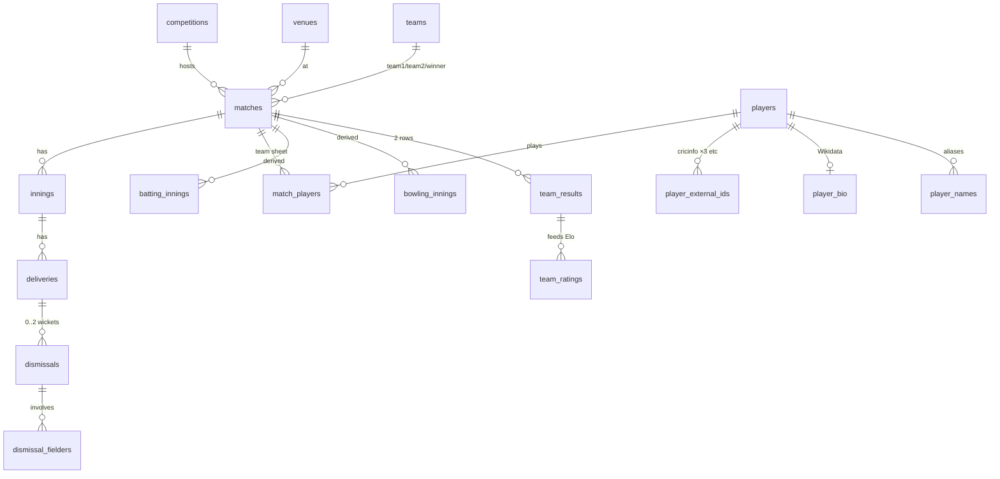

# F3 — cricstat data model

Status: **approved** (2026-10-05) · Schema: [`../sql/serving_schema.sql`](../sql/serving_schema.sql) (loads cleanly: 37 tables)
Based on a profile of all 22,983 active matches in `raw.sqlite` (11,615,100 deliveries, 15,177 players).

## 1. Layers
| Layer | Where | Built by | Grain / purpose |
|---|---|---|---|
| **Raw** (exists) | `data/db/raw.sqlite` | `cricstat-pipeline ingest` | One compressed JSON per match + hash; never edited |
| **Core** | `data/db/cricstat.sqlite` | new `cricstat-pipeline build` step | Normalised facts: matches, innings, deliveries, dismissals, players… |
| **Marts** | same file | same step | Player-innings "atoms" + small page aggregates + team results |
| **Semantic** | same file | same step | Views with F4 formulas + `semantic_catalog` descriptions for the agent |

Two files on purpose. The raw store belongs to the ingester and needs write access. The serving DB is
rebuilt from raw and swapped in whole, and the API and agent only ever read it (read-only mount, `journal_mode=DELETE`).

## 2. Entity overview

## 3. Keys and identity
- **Surrogate integer keys** (`match_key`, `player_key`, `team_key`…) keep the 11.6M-row `deliveries` table compact.
  Natural ids are kept alongside them. **`match_id` stays TEXT**, because 25 ids are `wi_*`.
- **Players:** a delivery names a player, e.g. "MA Starc". Each match's `info.registry.people` maps that name to the
  8-hex Cricsheet identifier, and the registry is present on 100% of matches. So names are resolved **per match**, never globally.
  - The Register `people.csv` provides `name` and `unique_name`, plus 21 `key_*` columns. These are stored in long form in
    `player_external_ids`. **`key_cricinfo`, `key_cricinfo_2` and `key_cricinfo_3` all exist**, so the Wikidata lookup
    (P2697) must try every Cricinfo id.
  - `names.csv` (identifier, name) provides name variants. With derived aliases (surname, initials) it fills
    `player_names`, which is the basis for "did you mean…".
- **Teams:** identity is `(name, gender, team_type)`, because "India" men, "India" women and a club named "India…" are different teams.
- **Players have no country field.** `player_teams` is derived from match appearances. Players can represent more than one team.
- **Venues:** there are 970 raw (name, city) pairs, with spelling variants. `canonical_venue_key` points each alias at a
  canonical venue (a manual map, started from the obvious duplicates). `country` is not in the source; see open question 2.

## 4. Format mapping (all raw combinations seen)
| match_type | team_type | balls/over | → `format_key` | Family | Level | Matches |
|---|---|---|---|---|---|---|
| Test | international | 6 | TEST | multi_day | international_official | 919 (895 men, 24 women) |
| ODI | international | 6 | ODI | one_day | international_official | 3,187 |
| T20 | international | 6 | T20I | t20 | international_official | 5,729 |
| IT20 | international | 6 | T20I_OTHER | t20 | international_other | 320 |
| ODM | international | 6 | OD_INTL_OTHER | one_day | international_other | 492 |
| MDM | international | 6 | MD_INTL_OTHER | multi_day | international_other | 17 |
| T20 | club | 6 | T20_LEAGUE | t20 | domestic | 8,156 (8,545 club T20s minus the Hundred) |
| T20 | club | **5** | HUNDRED | hundred | domestic | 389 (The Hundred: 201 men, 188 women) |
| ODM | club | 6 | LIST_A | one_day | domestic | 1,574 |
| MDM | club | 6 | FIRST_CLASS | multi_day | domestic | 2,200 |

The Players page tabs map to these keys: **Test**, **ODI**, **T20I**, **Leagues** (`T20_LEAGUE` + `HUNDRED`, split by
competition such as IPL) and **All**. `T20I_OTHER`, the other international formats and domestic List A / first-class
are kept in the database, and their display is open question 1. Phases come from `phase_defs`: T20 0–5 / 6–14 / 15–19,
ODI 0–9 / 10–39 / 40–49 (0-based overs). The Hundred is defined by balls, not overs, so it needs its own rule in F4.

## 5. How a delivery is modelled
- **Grain:** one ball bowled, legal or not. The key is `(match_key, innings_no, over_no, seq)`, where `seq` is the order within the over.
  `ball_label` keeps Cricsheet's `actual_delivery` (e.g. "0.1").
- **Runs:** `runs_batter`, `runs_extras`, `runs_total`, plus `non_boundary` (1,314 fours or sixes that were run or came
  from overthrows, so they are not boundaries).
- **Extras** are split into wides, no-balls, byes, leg-byes and penalty. `is_legal = 0` when the ball is a wide or a no-ball.
- **Wickets** go in `dismissals`, one row per wicket. 16 deliveries have two wickets.
  - `dismissal_kinds` is a reference table. It says whether each of the 14 kinds is **credited to the bowler** and whether it **counts as out**.
  - `dismissal_fielders` holds the fielders. 3,843 were substitutes, who may not be in the registry, so `player_key` can be NULL.
- **Innings:**
  - Super overs are extra innings with `is_super_over = 1`: 111 matches, with up to 8 innings in one.
  - Also kept: declared and forfeited flags, D/L-revised `target_runs` and `target_overs`, penalty runs, absent-hurt players.
  - Miscounted overs are kept too (611 innings, e.g. a 5-ball over).
- **Team sheets:** `match_players` holds the XI from `info.players`, plus supersubs (96 matches) and players who came in as replacements
  (impact player, concussion and injury). "Matches" counts come from this table, not from who batted or bowled.
- **Results:**
  - Win, tie, draw or no result, with the margin in runs, wickets or innings.
  - `method` (D/L 1,020; VJD 5; Awarded 5; Lost fewer wickets 1).
  - `decided_by` is play, super over (110 ties had an eliminator), bowl-out (2) or award.
- **Not modelled in v1:** officials beyond a simple list, and DRS reviews, which are kept in `reviews` for later analysis.

## 6. Marts → wireframe sections
| Wireframe section | Reads from |
|---|---|
| Players: batting / bowling / fielding tables | `player_career` (scope = TEST/ODI/T20I/league slug/ALL) + F4 views for avg, SR, econ |
| Players: year by year | `player_year` |
| Players: T20 phase splits | `phase_stats` |
| Players: top opponents & venues | `batting_innings` / `bowling_innings` grouped by `opponent_key` / `venue_key` |
| Players / hub: in-form players | `batting_innings` / `bowling_innings`, last 12 months |
| Countries: record, results by year, H2H, form | `team_results` |
| Countries: home vs away | `team_results.home_away` (needs venue country; open question 2) |
| Countries: most runs / wickets | `player_career` joined with `player_teams` |
| Hub "Following India" cards, Predictor | `team_ratings`, `forecast_runs`, `forecast_team`, `team_results` |
| Hub data strip, Methodology pipeline status | `build_info` + raw `ingest_runs` |
| Ask the Analyst | typed tools over the atoms + views; `semantic_catalog` describes every object |
| India at World Cups, IPL features | `matches.competition_key` (ICC Cricket World Cup / Indian Premier League) |

`player_career` stores **counts only**. Averages, strike rates and economy are computed in F4 views, so each formula
has exactly one definition.

## 7. Predictor hooks
- `team_results` gives one row per team per match, with date, venue and outcome. This is the Elo input, and it's
  filtered to official men's ODIs for the 2027 model.
- `team_ratings` stores the rating history after every rated match (`model_version` allows comparing models).
  `forecast_runs` and `forecast_team` store each simulation's stage probabilities, and `mlflow_run_id` links to MLflow.
- Afghanistan has no rows (Cricsheet withholds those matches). The model handles this with a disclosed prior; it is not a schema issue.

## 8. Build and refresh
- **Full build** (first run, monthly, and after any schema change):
  1. Read every raw match.
  2. Write core tables in batched transactions.
  3. Build marts with SQL.
  4. Fill `semantic_catalog`.
  5. Run checks.
  6. Swap the file in with `os.replace`.

  It parses about 4 GB of JSON: the profile pass alone took about 5 minutes on the NAS. A full build is estimated at 15–25 minutes, to be measured.
- **Daily incremental:**
  1. Copy the serving DB.
  2. For the match_ids the ingest run added or updated: delete their core rows, then re-insert them.
  3. Recompute the marts from the atoms.
  4. Check, then swap.

  The marts aggregate about 0.5M-row atom tables, so this should take minutes, not the full 15–25.
- **Quality checks before the swap** (they fail the build, and the old file is kept):
  - Row counts are consistent with raw.
  - For each innings, the sum of `runs_total` plus penalties equals `total_runs`.
  - No unresolved player names.
  - The golden-figure tests from F4.
- Readers keep an open connection to the old file until they reopen, so the API must reopen when `build_info` changes (F5/F6).

## 9. Size estimate
| Table | Rows (approx.) |
|---|---|
| deliveries | 11.6M |
| dismissals | 355k |
| match_players | ~510k |
| batting_innings | ~450k |
| bowling_innings | ~330k |
| phase_stats | ~1M |
| everything else | <100k each |

Estimated serving DB is **1.5–2.5 GB** with indexes. The NAS has about 26 TB free.

## 10. Data surprises (from the profile)
- **A source typo:** one wicket carries a `playeer_out` object next to the correct `player_out` (match 1410291). The loader
  ignores unknown keys; worth reporting to Cricsheet.
- **The Hundred** uses `balls_per_over = 5` (389 matches), so over-based phases and economy need a rule.
- **Season** is sometimes an integer and sometimes a string ("2023/24"), so it is normalised to TEXT.
- `city` is missing on 1,649 matches. `event` is missing on 89. `player_of_match` is missing on about 6k, and
  `info.missing` says so explicitly on 2,811.
- 14 innings have no overs (forfeited), and 371 matches have only one innings. `has_deliveries = 0` marks matches with no play.
- `outcome` has 11 shapes in the data, including `eliminator` (super-over winner), `bowl_out`, and `method` without a winner.

## 11. Cricket traps to settle in F4 (the data is ready for every option)
1. Retired hurt and retired not out are not dismissals; retired out is. Decide for timed out, handled the ball, obstructing the field and hit the ball twice.
2. Bowler credit: bowled, caught, caught and bowled, lbw, stumped and hit wicket count; run outs and the "other" kinds don't.
3. Balls faced exclude wides but include no-balls. A bowler's legal balls exclude both.
4. Byes and leg-byes are not charged to the bowler. Penalty runs are charged to no one.
5. Maidens: decide whether byes or leg-byes in an over still allow a maiden, and how to treat miscounted overs.
6. Super-over runs and wickets are excluded from career stats by default.
7. Economy and strike rate for 5-ball Hundred "overs" (per 6 legal balls is the usual convention).
8. What counts as a match appearance for replacements and supersubs.
9. Matches with no play: counted in team records? (the usual answer is no-result yes, abandoned without a toss no).

## 12. Review decisions (2026-10-05)
1. **Extra formats:** T20I_OTHER, OD_INTL_OTHER, MD_INTL_OTHER, LIST_A and FIRST_CLASS stay in the DB. They're shown later under
   "More formats" (v1.1). v1 tabs are Test / ODI / T20I / Leagues / All.
2. **Venue country:** draft a one-off venue → country map from city names and hand-check it. Used for home/away and the predictor's home advantage.
3. **Build step:** a `build` command in `cricstat-pipeline` (same image, runs after ingest).
4. **Featured leagues (v1):** IPL, BBL, PSL, CPL, SA20, The Hundred, MLC, T20 Blast; women's WPL, WBBL, The Hundred (women).
