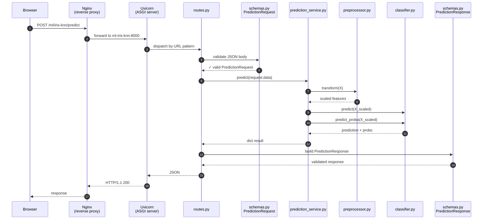
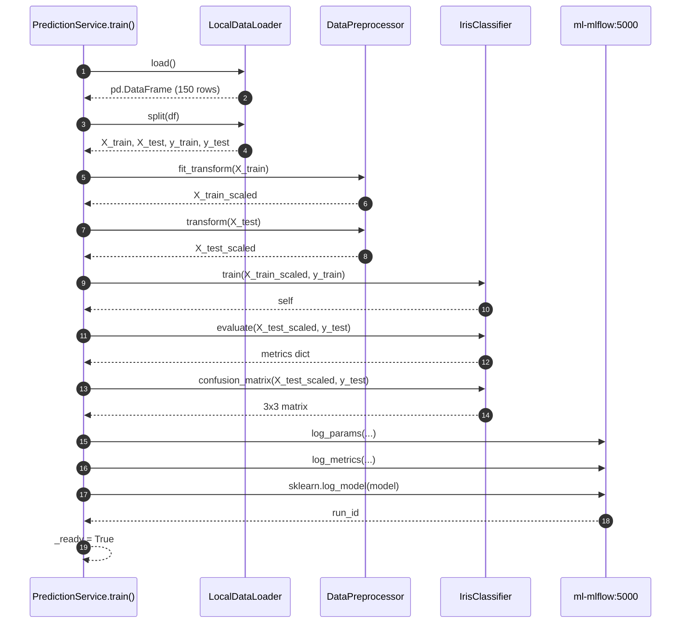

# ML Project Walkthrough — `ml-iris-knn`

**A guided tour of how a working ML service is built on pandyaHomeLab.**

This document walks through one project — `ml-iris-knn` — from the outside in. The goal is that after reading it, you can:

1. Open any file in `ml/ml-iris-knn/` and instantly know what it does and why
2. Trace what happens when an HTTPS request arrives, all the way through the 4 layers
3. Understand the Python modular patterns used here so you can apply them anywhere

Every code block in this document is **pulled directly from the working codebase** — not paraphrased. Line numbers refer to the file as it exists at the time of writing; if the file has changed since, treat the line numbers as approximate and use the surrounding context to find your way.

> **Why iris-knn as the worked example?**
> It's the smallest service on the platform. All four layers are present, all the patterns are in place, but nothing is hidden behind framework magic. If you understand iris-knn, the other two ML projects (`ml-housing-linear`, `ml-titanic-automl`) are minor variations of the same shape.

---

## Table of Contents

1. [Why this guide exists](#1-why-this-guide-exists)
2. [Project anatomy — the file tree](#2-project-anatomy--the-file-tree)
3. [The 4-layer architecture](#3-the-4-layer-architecture)
4. [Flow 1 — a `/predict` request, step by step](#4-flow-1--a-predict-request-step-by-step)
5. [Flow 2 — training on the first request](#5-flow-2--training-on-the-first-request)
6. [Per-layer deep dive](#6-per-layer-deep-dive)
7. [Python modular patterns used here](#7-python-modular-patterns-used-here)
8. [The MLflow integration story](#8-the-mlflow-integration-story)
9. [Where to look next](#9-where-to-look-next)

---

## 1. Why this guide exists

Most ML tutorials show you a Jupyter notebook with `model.fit()` and `model.predict()`. That's enough to learn the algorithm but not enough to ship a service. The interesting work is everything *around* the model:

- How does an HTTP request reach the model?
- Where does input validation happen, and what makes that the right place?
- How is the model loaded? Trained? Persisted?
- Where do predictions get logged for audit?
- Where do experiment metrics go?
- How does the project stay testable when each piece is in its own file?

This guide answers those questions by walking through one specific working service. You'll see real code, real call chains, and real architectural decisions — not toy examples.

If you're new to Python packaging, FastAPI, or scikit-learn, read this front-to-back. If you're experienced and just want to find where preprocessing happens, jump to [Section 6](#6-per-layer-deep-dive).

---

## 2. Project anatomy — the file tree

Here's the entire `ml/ml-iris-knn/` directory, annotated. Every file in production is listed; what's missing is `__pycache__/`, `.pytest_cache/`, and the (gitignored) `data/` and `models/` folders.

```
ml/ml-iris-knn/
├── pyproject.toml                          ← package metadata, deps, build config
├── requirements.txt                        ← pinned runtime deps for Docker
├── requirements-dev.txt                    ← linters, pytest, formatters
├── Makefile                                ← build/test/deploy shortcuts
├── README.md                               ← project description (per-project)
├── CHANGELOG.md                            ← release notes
├── .env.example                            ← template for local env vars
├── .gitignore
│
├── docker/
│   └── Dockerfile                          ← multi-stage build (builder + runtime)
│
├── presentation-logic/                     ← LAYER 1: HTTP API surface
│   ├── __init__.py                         ← marks dir as a Python package
│   ├── api/
│   │   ├── main.py                         ← FastAPI app factory + lifecycle
│   │   ├── routes.py                       ← URL → handler mapping
│   │   ├── schemas.py                      ← Pydantic request/response models
│   │   ├── dependencies.py                 ← DI container (placeholder for now)
│   │   ├── ui.html                         ← in-browser demo page
│   │   └── about.json                      ← educational content for About drawer
│   └── errors/
│       └── handlers.py                     ← custom exception → JSON mapping
│
├── application-logic/                      ← LAYER 2: business logic / orchestration
│   ├── __init__.py
│   ├── services/
│   │   └── prediction_service.py           ← the orchestrator — owns the workflow
│   ├── model/
│   │   └── classifier.py                   ← KNN wrapper (sklearn under the hood)
│   └── pipeline/
│       └── inference_pipeline.py           ← (reserved for future pipeline patterns)
│
├── db-logic/                               ← LAYER 3: data access
│   ├── __init__.py
│   ├── loaders/
│   │   └── loaders.py                      ← read dataset from disk + train/test split
│   ├── transforms/
│   │   └── preprocessor.py                 ← StandardScaler wrapper
│   └── repository/
│       └── prediction_repository.py        ← (reserved — DB audit trail, not yet wired)
│
├── shared/                                 ← LAYER 4: cross-cutting utilities
│   ├── __init__.py
│   ├── config.py                           ← env-var driven Config singleton
│   ├── logger.py                           ← JSON structured logger
│   ├── constants.py                        ← magic numbers in one place
│   ├── exceptions.py                       ← custom exception hierarchy
│   ├── metrics.py                          ← (reserved — Prometheus, etc.)
│   └── utils.py                            ← (reserved — misc helpers)
│
├── tests/
│   ├── conftest.py                         ← shared pytest fixtures
│   ├── presentation/
│   │   └── test_routes.py                  ← API-level tests with TestClient
│   ├── application/
│   │   └── test_classifier.py              ← model-level tests
│   └── db/
│       └── test_loaders.py                 ← data layer tests
│
├── application_logic                       ← SYMLINK → application-logic/
├── db_logic                                ← SYMLINK → db-logic/
└── presentation_logic                      ← SYMLINK → presentation-logic/
```

A few things to notice:

**(a) Hyphens vs. underscores.** The directories on disk use hyphens (`presentation-logic`) because that reads better. But Python import statements only allow underscores. The three symlinks at the bottom solve the mismatch — they let `from presentation_logic.api.main import app` resolve to the file at `presentation-logic/api/main.py`. We'll come back to this in [Section 7](#7-python-modular-patterns-used-here).

**(b) Empty-looking files.** `__init__.py` files appear empty but are crucial — their *presence* (not their contents) is what tells Python "this directory is a package." Without them, `import presentation_logic.api.main` would fail.

**(c) "Reserved" placeholders.** A few files (`dependencies.py`, `inference_pipeline.py`, `prediction_repository.py`, `metrics.py`, `utils.py`) are intentionally minimal. They mark a place where a future feature will land. Why include them now? So when you grep for "where do we save predictions to the DB?" you find the placeholder immediately and don't waste time wondering if it exists somewhere else.

**(d) Each layer has its own directory** — this is on purpose. Files of the same *kind* live together, not files about the same *feature*. We'll justify this in the next section.

---

## 3. The 4-layer architecture

Every project on pandyaHomeLab follows the same four-layer shape, locked in by [ADR-013](adr/). Here's how the layers stack and what each owns:

```mermaid
graph TB
  subgraph "Outside world"
    HTTP[HTTPS request]
  end

  subgraph "presentation-logic (Layer 1)"
    direction TB
    Routes[routes.py<br/>URL → handler]
    Schemas[schemas.py<br/>Pydantic models]
    Main[main.py<br/>FastAPI factory]
  end

  subgraph "application-logic (Layer 2)"
    direction TB
    Service[prediction_service.py<br/>orchestrator]
    Model[classifier.py<br/>KNN wrapper]
  end

  subgraph "db-logic (Layer 3)"
    direction TB
    Loader[loaders.py<br/>dataset loader]
    Preproc[preprocessor.py<br/>StandardScaler]
    Repo[prediction_repository.py<br/>(future)]
  end

  subgraph "shared (Layer 4)"
    direction TB
    Config[config.py]
    Logger[logger.py]
    Exc[exceptions.py]
  end

  HTTP --> Routes
  Routes --> Schemas
  Routes --> Service
  Service --> Model
  Service --> Loader
  Service --> Preproc

  Routes -.uses.-> Logger
  Service -.uses.-> Logger
  Model -.uses.-> Exc
  Loader -.uses.-> Config

  classDef l1 fill:#1a3a5c,stroke:#4f8ef7,color:#e2e8f0
  classDef l2 fill:#3a1a5c,stroke:#a855f7,color:#e2e8f0
  classDef l3 fill:#5c3a1a,stroke:#f97316,color:#e2e8f0
  classDef l4 fill:#1a5c3a,stroke:#22c55e,color:#e2e8f0
  class Routes,Schemas,Main l1
  class Service,Model l2
  class Loader,Preproc,Repo l3
  class Config,Logger,Exc l4
```

### What each layer owns and what it must NOT do

| Layer | Owns | Must NOT |
|---|---|---|
| **presentation-logic** | HTTP routes, request/response shapes, validation rules, error → status code mapping, the demo UI | Run any model code, touch sklearn directly, hold model state |
| **application-logic** | Workflow orchestration ("first load, then preprocess, then predict, then log"), the model itself | Know about HTTP, parse JSON, render UI |
| **db-logic** | Reading data, writing data, splitting, scaling | Know about HTTP, know about the model algorithm |
| **shared** | Things that make sense in *every* layer: config, logger, exceptions, constants | Import from any of the other three layers (no upward dependencies) |

### Why this layering?

Three concrete reasons:

**1. Testability.** You can test the classifier without spinning up FastAPI. You can test the routes by mocking the service. You can test the loader without a model. Each layer has a clear seam.

**2. Replaceability.** Want to swap from FastAPI to Flask? Only `presentation-logic/` changes. Want to swap KNN for Random Forest? Only `application-logic/model/` changes. Want to load the dataset from PostgreSQL instead of a CSV? Only `db-logic/loaders/` changes. The *interfaces between layers* stay stable; the *implementations* are free to evolve.

**3. Cognitive load.** When you open any file you immediately know what concerns belong there and what doesn't. If you find yourself doing JSON parsing in the model layer, you know you're in the wrong place.

### The dependency rule

Read the diagram top to bottom. **Dependencies only flow downward.** `presentation-logic` knows about `application-logic`. `application-logic` knows about `db-logic`. `db-logic` doesn't know about anyone above it. `shared` is below everyone — anybody can import from `shared`, but nothing in `shared` may import from a numbered layer.

That rule prevents circular imports and keeps the architecture clean. If you ever feel tempted to break it, the right answer is almost always "extract this into `shared/` or rethink the boundary."

---

## 4. Flow 1 — a `/predict` request, step by step

Let's trace a single real request from the moment it leaves your browser until the JSON response comes back. The request:

```http
POST /ml/iris-knn/predict HTTP/1.1
Host: pandyahomelab.com
Content-Type: application/json

{ "data": [5.1, 3.5, 1.4, 0.2] }
```

Here's the full call chain at a glance:



Let's go hop by hop with real code.

### Hop 1 — Nginx proxies to the container

The request hits Nginx first. Nginx terminates TLS, then matches the URL prefix `/ml/iris-knn/` to an upstream block. From `deployment/nginx/nginx.conf`:

```nginx
upstream ml_projects {
    server ml-iris-knn:8000 max_fails=3 fail_timeout=30s;
}

location /ml/iris-knn/ {
    proxy_pass http://ml_projects/;
    ...
}
```

The trailing slash on both sides means `/ml/iris-knn/predict` becomes `/predict` when forwarded — the container doesn't need to know about the URL prefix. That's a nice separation: Nginx owns the public URL space, the container owns its own internal routes.

### Hop 2 — Uvicorn dispatches to FastAPI

Inside the container, `uvicorn presentation_logic.api.main:app` is running. When the request arrives on port 8000, Uvicorn hands it to the FastAPI app object exported from [main.py](../ml/ml-iris-knn/presentation-logic/api/main.py):

```python
# presentation-logic/api/main.py
"""FastAPI application factory for Iris KNN classifier."""
from datetime import datetime
from fastapi import FastAPI

from presentation_logic.api.routes import router


def create_app() -> FastAPI:
    app = FastAPI(
        title="Iris KNN Classifier",
        description="K-Nearest Neighbors classifier for Iris species prediction",
        version="1.0.0-alpha1",
    )

    app.include_router(router)
    ...
    return app


app = create_app()
```

Notice the *factory* pattern (`create_app()` returns a fresh app). Tests can call `create_app()` to get an isolated app per test — they don't have to reuse the module-level `app` object. The trailing `app = create_app()` line exists because Uvicorn imports the symbol it's pointed at, and it expects that symbol to already be a FastAPI instance.

### Hop 3 — `routes.py` matches the URL to a handler

FastAPI walks its route table and finds the `POST /predict` handler in [routes.py](../ml/ml-iris-knn/presentation-logic/api/routes.py):

```python
# presentation-logic/api/routes.py
@router.post("/predict", response_model=PredictionResponse)
async def predict(
    request: PredictionRequest,
    x_request_id: Optional[str] = Header(None),
):
    request_id = x_request_id or str(uuid.uuid4())
    try:
        result = _service.predict(request.data)
        return PredictionResponse(
            prediction=result["prediction"],
            species=result["species"],
            confidence=result["confidence"],
            probabilities=result["probabilities"],
            request_id=request_id,
        )
    except Exception as e:
        logger.error(f"[{request_id}] Prediction failed: {e}")
        raise HTTPException(status_code=500, detail=str(e))
```

Three details worth pausing on:

- **The function signature is the contract.** FastAPI inspects the annotated parameter types (`request: PredictionRequest`, `x_request_id: Optional[str] = Header(None)`) and *automatically* parses the JSON body, validates it, and pulls headers. You never call a parser by hand.
- **The function body is tiny.** It delegates all real work to `_service.predict(...)`. The only logic in the route is glue: assemble a request_id, call the service, wrap the result in a response model, handle exceptions.
- **`response_model=PredictionResponse`** instructs FastAPI to validate and serialize the *return value* through the Pydantic model. If the service returns a dict missing `species`, FastAPI raises before the bytes hit the wire.

### Hop 4 — Pydantic validates the input

Before our function body even starts, FastAPI has already parsed the JSON body and instantiated [PredictionRequest](../ml/ml-iris-knn/presentation-logic/api/schemas.py):

```python
# presentation-logic/api/schemas.py
class PredictionRequest(BaseModel):
    data: List[float] = Field(..., description="4 iris features: ...")

    @field_validator("data")
    @classmethod
    def validate_features(cls, v):
        if len(v) != 4:
            raise ValueError("Exactly 4 features required: ...")
        if any(f <= 0 for f in v):
            raise ValueError("All feature values must be positive")
        return v
```

If the request was `{"data": [5.1, 3.5]}`, Pydantic raises and FastAPI returns **HTTP 422** with a structured error message. Our route handler is never called. This is the validation seam: the route trusts that anything reaching its body has already passed input checks.

The `@field_validator` is a Pydantic v2 pattern. The `@classmethod` decorator is required (Pydantic v2 changed this from v1) and the function receives the field value `v`, not the whole model.

### Hop 5 — The route delegates to the service

Back in the route, this single line is where the real work begins:

```python
result = _service.predict(request.data)
```

`_service` is a module-level singleton created at import time:

```python
# routes.py, near the top
_service = PredictionService()
```

A module-level singleton is fine for stateless or lazily-initialised services; the FastAPI/uvicorn workers each get their own copy. For services with heavy initialisation (PyCaret in `ml-titanic-automl`, for example) the lazy approach matters because we want the model trained *once*, not on every request.

### Hop 6 — `PredictionService` orchestrates

In [prediction_service.py](../ml/ml-iris-knn/application-logic/services/prediction_service.py):

```python
# application-logic/services/prediction_service.py
def predict(self, features: List[float]) -> Dict:
    if not self._ready:
        self.train()                                          # ① lazy training
    import pandas as pd
    X = pd.DataFrame([features], columns=self._loader.get_feature_names())  # ② shape input
    X_scaled = self._preprocessor.transform(X)                # ③ scale
    prediction = self._classifier.predict(X_scaled)[0]        # ④ classify
    probabilities = self._classifier.predict_proba(X_scaled)[0]  # ⑤ confidence
    return {
        "prediction": prediction,
        "species": IrisClassifier.CLASSES[prediction],
        "confidence": round(max(probabilities), 4),
        "probabilities": {
            IrisClassifier.CLASSES[i]: round(p, 4)
            for i, p in enumerate(probabilities)
        },
    }
```

Note what this method *doesn't* do:

- It doesn't parse JSON — the route did that
- It doesn't validate inputs — Pydantic did that
- It doesn't fit a model — that's `train()`'s job (called lazily on first request)
- It doesn't touch the database, MLflow, or any HTTP client

It's pure orchestration: load → shape → scale → predict → format. If any of those steps needs to change, only one method changes.

The `if not self._ready: self.train()` line is the **lazy initialisation pattern**. The first request pays the training cost (~1 second for iris); subsequent requests find `_ready == True` and skip straight to inference. This is fine here because training is fast. For heavier models (the PyCaret AutoML service in `ml-titanic-automl`) we might want to train at startup instead.

### Hop 7 — Preprocessor scales the features

```python
# db-logic/transforms/preprocessor.py
def transform(self, X: pd.DataFrame) -> np.ndarray:
    if not self._fitted:
        raise RuntimeError("Preprocessor must be fitted before calling transform.")
    return self._scaler.transform(X)
```

This is just a thin wrapper around `sklearn.preprocessing.StandardScaler`. Why bother wrapping it?

- We get a clear seam in the architecture (one place owns "feature scaling")
- We can swap `StandardScaler` for `MinMaxScaler` or a custom transformer without changing callers
- The `_fitted` guard catches the bug where someone tries to transform before fit
- Tests can mock `DataPreprocessor` instead of the entire scikit-learn ecosystem

### Hop 8 — Classifier returns prediction + probabilities

```python
# application-logic/model/classifier.py
def predict(self, X) -> List[int]:
    self._check_trained()
    return self._model.predict(X).tolist()

def predict_proba(self, X) -> List[List[float]]:
    self._check_trained()
    return self._model.predict_proba(X).tolist()
```

`self._model` is a `KNeighborsClassifier(n_neighbors=3, algorithm="ball_tree")` from sklearn. The wrapper calls into it twice — once for the hard prediction (which class), once for the probabilities (how confident).

`.tolist()` is here because sklearn returns numpy arrays. Numpy arrays don't JSON-serialise cleanly; lists do. Convert at the boundary.

### Hop 9 — The service formats the response

Back in `predict()`:

```python
return {
    "prediction": prediction,
    "species": IrisClassifier.CLASSES[prediction],
    "confidence": round(max(probabilities), 4),
    "probabilities": {
        IrisClassifier.CLASSES[i]: round(p, 4)
        for i, p in enumerate(probabilities)
    },
}
```

The service returns a `dict` — not a `PredictionResponse`. The route wraps it. Why this split?

- **The service shouldn't know about HTTP.** If someone wanted to call `predict()` from a Jupyter notebook or a CLI, they shouldn't be forced to construct an HTTP response model.
- **The route owns the API shape.** If we add a new field to `PredictionResponse`, only the route changes.

`IrisClassifier.CLASSES` is a class-level dict mapping `0 → "setosa"`, etc. That mapping lives with the model because it's tied to the model's training labels.

### Hop 10 — `PredictionResponse` validates and serialises

```python
return PredictionResponse(
    prediction=result["prediction"],
    species=result["species"],
    ...
    request_id=request_id,
)
```

[PredictionResponse](../ml/ml-iris-knn/presentation-logic/api/schemas.py):

```python
class PredictionResponse(BaseModel):
    prediction: int = Field(..., description="Predicted class (0=setosa, ...)")
    species: str = Field(...)
    confidence: float = Field(...)
    probabilities: Dict[str, float] = Field(...)
    request_id: Optional[str] = Field(None)
```

Pydantic checks each field's type, rejects anything that doesn't fit, and FastAPI then serialises to JSON. The body that hits the wire:

```json
{
  "prediction": 0,
  "species": "setosa",
  "confidence": 1.0,
  "probabilities": {"setosa": 1.0, "versicolor": 0.0, "virginica": 0.0},
  "request_id": "abc-123"
}
```

### Hop 11 — Back through Uvicorn → Nginx → Browser

The response travels back the same way it came — Uvicorn writes the bytes, Nginx forwards them, the browser parses the JSON.

**Total time end-to-end: about 5-10 milliseconds** once the model is trained. The first request pays an extra ~1 second for training; everything after that is fast.

### What we just learned

In the eleven hops above, every layer played its assigned role:

- **presentation-logic** — handled HTTP, validated input, shaped the response
- **application-logic** — orchestrated the steps, owned the model
- **db-logic** — owned the data shape and the scaler
- **shared** (silently) — provided the logger that wrote audit lines

If you understand this flow, you understand 80% of every project on the platform.

---

## 5. Flow 2 — training on the first request

We mentioned the lazy `if not self._ready: self.train()` line in the previous section. Let's look at what `train()` actually does, because it's a slightly different sequence:



Here's the full method, condensed for readability (some MLflow boilerplate omitted):

```python
# application-logic/services/prediction_service.py
def train(self) -> Dict:
    df = self._loader.load()                                       # ①
    X_train, X_test, y_train, y_test = self._loader.split(df)      # ②
    X_train_scaled = self._preprocessor.fit_transform(X_train)     # ③
    X_test_scaled = self._preprocessor.transform(X_test)           # ④
    self._classifier.train(X_train_scaled, y_train)                # ⑤
    self._metrics = self._classifier.evaluate(X_test_scaled, y_test)  # ⑥
    self._confusion_matrix = self._classifier.confusion_matrix(X_test_scaled, y_test)
    self._train_size = len(y_train)
    self._test_size = len(y_test)
    self._ready = True

    # MLflow logging — wrapped in try/except for graceful degradation
    try:
        import mlflow
        import mlflow.sklearn
        mlflow.set_tracking_uri(_MLFLOW_URI)
        mlflow.set_experiment(_EXPERIMENT)
        with mlflow.start_run() as run:
            mlflow.log_params({"n_neighbors": 3, ...})             # ⑦
            mlflow.log_metrics(self._metrics)                       # ⑧
            self._run_id = run.info.run_id
            self._experiment_id = str(run.info.experiment_id)
            try:
                mlflow.sklearn.log_model(self._classifier._model, "model")  # ⑨
            except Exception as artifact_err:
                logger.warning(f"MLflow artifact logging skipped: {artifact_err}")
    except Exception as e:
        logger.warning(f"MLflow logging skipped: {e}")

    return self._metrics
```

### What each numbered step does

**① Load.** [`LocalDataLoader.load()`](../ml/ml-iris-knn/db-logic/loaders/loaders.py) reads `data/iris.csv` into a DataFrame and maps the species column from strings to integer labels. The path is computed relative to the loader file itself:

```python
path = os.path.join(os.path.dirname(__file__), "../../data/iris.csv")
```

That `__file__`-relative path is the conventional way to make data paths portable — no matter where the working directory is when the process starts, the path resolves to the same place.

**② Split.** Same loader, different method:

```python
def split(self, df, test_size=0.2, random_state=42):
    X = self.get_features(df)
    y = self.get_target(df)
    return train_test_split(X, y, test_size=test_size, random_state=random_state)
```

`random_state=42` makes the split reproducible. Same dataset → same split → same model → same metrics. Without that, every container start would give slightly different test accuracy, and you'd never know if a regression was your code or just the random seed.

Worth noting: this is *not* a stratified split (sklearn's default is shuffled but not stratified). With 150 samples / 50 per class / `test_size=0.2`, the test set has 30 rows but the per-class breakdown drifts slightly — in practice for `random_state=42` it's 10 setosa / 9 versicolor / 11 virginica. We confirmed this earlier when we wired the confusion matrix to live data.

**③ Fit + transform on train.** `StandardScaler` learns the mean and standard deviation *from the training set only*, then transforms it. Critical: never fit on test data — that's information leakage.

**④ Transform-only on test.** Test data uses the *training* statistics. This is what `transform()` (without `fit`) does. The `_fitted` guard in the preprocessor exists to catch the bug where you accidentally call `transform()` before `fit()`.

**⑤ Train.** [`IrisClassifier.train(X_train_scaled, y_train)`](../ml/ml-iris-knn/application-logic/model/classifier.py) calls `KNeighborsClassifier.fit()` under the hood. KNN actually doesn't "train" in the gradient-descent sense — it just memorises the training points and builds a tree (`ball_tree` here) for fast neighbour lookup at inference time.

**⑥ Evaluate + ⑥' confusion matrix.** Run the trained model against the held-out test set, compute accuracy/precision/recall/F1, and a confusion matrix. The classifier exposes both as separate methods — they could in principle share the `predict()` call, but factoring them apart keeps each method's contract clean.

**⑦ Log params.** The hyperparameters and dataset metadata. These let you go back six months later and know what configuration produced this model.

**⑧ Log metrics.** Numeric performance numbers. MLflow stores these in its SQLite DB so you can compare runs.

**⑨ Log model artifact.** The pickled scikit-learn model goes to MLflow's artifact store. This is what would let you re-load the *exact* trained model elsewhere without retraining.

### Why training is wrapped in try/except

```python
try:
    import mlflow
    ...
except Exception as e:
    logger.warning(f"MLflow logging skipped: {e}")
```

The model is fully trained *before* the MLflow block. If MLflow is down (container crashed, network glitch), the service still works — predictions still happen, the user still gets responses. We just lose the experiment record for that run, which is degraded but not fatal.

This is **graceful degradation**: the critical path (predictions) keeps working when an auxiliary system (experiment tracking) fails. Designing for graceful degradation is a habit worth practicing — it's the difference between an "incident" (degraded but working) and an "outage" (down).

### Why it all happens on first request

Why not train at container startup? A few reasons:

- **Faster startup** — the container becomes "healthy" immediately, before training. Useful for orchestration (Docker healthchecks, Kubernetes readiness probes).
- **Optional training** — if a request never comes, we never spend the time. Trivial here, but matters more for heavy models.
- **Simpler error handling** — if training fails at startup, the container won't start at all, and the user gets nothing. With lazy training, the first request returns a 500 with an actual error message and you can debug.

Trade-off: the first user pays the ~1 second training cost. For iris that's fine. For larger models, you'd want to either train at startup or kick off training in a background thread on startup so the first request just waits briefly.

---

## 6. Per-layer deep dive

Now that you've seen the *flow*, let's go layer by layer and look at the *patterns* each one uses.

### 6.1 — `presentation-logic/`

Three files do the heavy lifting: `main.py`, `routes.py`, `schemas.py`.

**`main.py` — the application factory**

```python
def create_app() -> FastAPI:
    app = FastAPI(title="...", version="...")
    app.include_router(router)
    @app.on_event("startup")
    async def startup_event():
        print(f"[{datetime.utcnow().isoformat()}] Iris KNN service starting")
    @app.on_event("shutdown")
    async def shutdown_event():
        print(...)
    return app

app = create_app()
```

The factory pattern (function returns app) is the textbook approach for FastAPI. Why bother with a factory if there's only one app per process?

- **Tests** want isolated apps. Each test can call `create_app()` and get a fresh one with no leftover state.
- **Configuration** can be passed in: `create_app(config=test_config)`.
- **Middleware** can be added conditionally based on environment.

The bare `app = create_app()` at module scope is for Uvicorn — when you say `uvicorn presentation_logic.api.main:app`, Uvicorn imports the module and grabs the `app` symbol. So it has to exist.

**`routes.py` — URL → handler**

The pattern in every route is the same:

```python
@router.<METHOD>("<PATH>", response_model=<ResponseModel>)
async def handler(
    request: <RequestModel>,             # Pydantic validates body
    x_request_id: Optional[str] = Header(None),  # FastAPI parses headers
):
    request_id = x_request_id or str(uuid.uuid4())
    try:
        result = _service.<METHOD>(request.<FIELD>)
        return <ResponseModel>(..., request_id=request_id)
    except Exception as e:
        logger.error(f"[{request_id}] ... failed: {e}")
        raise HTTPException(status_code=500, detail=str(e))
```

That structure repeats for `/health`, `/predict`, `/model-info`. Differences are only in the request/response models and the service method called. When you add a new endpoint, copy this pattern.

**`schemas.py` — Pydantic v2 contracts**

```python
class PredictionRequest(BaseModel):
    data: List[float] = Field(..., description="...")

    @field_validator("data")
    @classmethod
    def validate_features(cls, v):
        if len(v) != 4:
            raise ValueError("Exactly 4 features required: ...")
        ...
```

A few Pydantic v2 specifics:

- `Field(..., description="...")` — the `...` is the Python sentinel for "required". The `description` shows up in the auto-generated OpenAPI docs at `/docs`.
- `@field_validator` is v2 (was `@validator` in v1) and `@classmethod` is now mandatory.
- `Literal["male", "female"]` (used in titanic-automl) gives you enum-like typing for free.
- `model_config = ConfigDict(strict=True)` makes Pydantic refuse to coerce types — `"5"` won't be silently converted to `5`.

### 6.2 — `application-logic/`

Two real files here: `services/prediction_service.py` and `model/classifier.py`. (`pipeline/inference_pipeline.py` is reserved.)

**`services/prediction_service.py` — the orchestrator**

This is the "verb" of the layer. It owns *what should happen* and *in what order*. The classifier owns *how to fit and predict*. The loader owns *where data comes from*. The service stitches them together.

A service typically:

- Holds references to the things it orchestrates (`self._loader`, `self._preprocessor`, `self._classifier`)
- Has a couple of public methods that match the "verbs" your API needs (`predict`, `train`, `get_model_info`)
- Tracks readiness state (`self._ready`)
- Knows when to lazily initialise

When you add a new use case (say, `evaluate_against_external_dataset`), you add a new method here. You don't add a new file in `presentation-logic/` *first* — the route is just a thin wrapper.

**`model/classifier.py` — the model wrapper**

```python
class BaseClassifier(ABC):
    @abstractmethod
    def train(self, X_train, y_train): ...
    @abstractmethod
    def predict(self, X) -> List[int]: ...
    @abstractmethod
    def evaluate(self, X_test, y_test) -> Dict: ...

class IrisClassifier(BaseClassifier):
    CLASSES = {0: "setosa", 1: "versicolor", 2: "virginica"}

    def __init__(self, n_neighbors: int = 3):
        self._model = KNeighborsClassifier(n_neighbors=n_neighbors, algorithm="ball_tree")
        self._trained = False

    def train(self, X_train, y_train) -> "IrisClassifier":
        self._model.fit(X_train, y_train)
        self._trained = True
        return self
    ...
```

A few patterns:

- **`BaseClassifier(ABC)`** — defines the contract any classifier in this project must satisfy. If we add a `RandomForestClassifier` later, it has the same shape.
- **Class-level `CLASSES` dict** — the label-to-name mapping lives with the model because it depends on the model's training labels.
- **`return self`** — `train()` returns the classifier so you can chain (`clf.train(X, y).predict(X_new)`). It's a fluent-API touch.
- **`_check_trained()`** — defensive guard that raises a clear error if you call `predict()` before `train()`. Better than a confusing sklearn traceback five frames deep.

### 6.3 — `db-logic/`

Two real files: `loaders/loaders.py`, `transforms/preprocessor.py`. (`repository/prediction_repository.py` is reserved.)

**`loaders/loaders.py` — abstract base + concrete loader**

```python
class BaseDataLoader(ABC):
    @abstractmethod
    def load(self) -> pd.DataFrame: ...

class LocalDataLoader(BaseDataLoader):
    FEATURE_COLS = ["sepal_length", "sepal_width", "petal_length", "petal_width"]
    TARGET_COL = "species"
    LABEL_MAP = {"setosa": 0, "versicolor": 1, "virginica": 2}

    def __init__(self, path: Optional[str] = None):
        if path is None:
            path = os.path.join(os.path.dirname(__file__), "../../data/iris.csv")
        self.path = os.path.abspath(path)

    def load(self) -> pd.DataFrame:
        df = pd.read_csv(self.path)
        df[self.TARGET_COL] = df[self.TARGET_COL].map(self.LABEL_MAP)
        return df
```

The abstract base means future loaders (`S3DataLoader`, `PostgresLoader`) all share a `load()` method signature. The other ML projects show the variations:

- **`ml-housing-linear`** loads `fetch_california_housing()` from sklearn directly
- **`ml-titanic-automl`** uses `seaborn.load_dataset('titanic')` *and* persists to PostgreSQL on first load — the hybrid pattern (download once, serve from DB after)

**`transforms/preprocessor.py` — wrapper around StandardScaler**

```python
class DataPreprocessor:
    def __init__(self):
        self._scaler = StandardScaler()
        self._fitted = False

    def fit(self, X) -> "DataPreprocessor":
        self._scaler.fit(X)
        self._fitted = True
        return self

    def transform(self, X) -> np.ndarray:
        if not self._fitted:
            raise RuntimeError("Preprocessor must be fitted before calling transform.")
        return self._scaler.transform(X)

    def fit_transform(self, X) -> np.ndarray:
        return self.fit(X).transform(X)
```

The `_fitted` flag exists because `transform()` before `fit()` returns garbage (or crashes deep in sklearn). Catching it at our layer with a clear error saves debugging time.

### 6.4 — `shared/`

The cross-cutting layer. Files here are short and importable by anyone.

**`config.py` — environment-driven, singleton**

```python
class Config:
    def __init__(self):
        self.DEBUG = os.getenv("DEBUG", "false").lower() == "true"
        self.API_PORT = int(os.getenv("API_PORT", "8000"))
        self.DATABASE_URL = os.getenv("DATABASE_URL", "postgresql://...")
        self.MLFLOW_TRACKING_URI = os.getenv("MLFLOW_TRACKING_URI", "http://localhost:5000")
        ...

_config: Optional[Config] = None

def get_config() -> Config:
    global _config
    if _config is None:
        _config = Config()
    return _config
```

The pattern: **read env vars once at startup, expose typed attributes.** Anywhere in the codebase that needs config calls `get_config()`. The singleton means env vars are read exactly once even if `get_config()` is called from a hundred places.

Why not a global module-level `config = Config()`? Because then it'd be created at import time. Lazy creation in `get_config()` lets tests monkeypatch `os.environ` *before* the Config object is built.

**`logger.py` — structured JSON logging**

```python
class JSONFormatter(logging.Formatter):
    def format(self, record):
        log_obj = {
            "timestamp": datetime.utcnow().isoformat(),
            "level": record.levelname,
            "logger": record.name,
            "message": record.getMessage(),
        }
        if hasattr(record, "request_id"):
            log_obj["request_id"] = record.request_id
        ...
        return json.dumps(log_obj)
```

JSON logs are machine-parseable. Once these go to stdout, the Docker JSON-file driver picks them up, and any log aggregator (Loki, ELK, CloudWatch) ingests them as structured events. Compare to plain text logs which a human can read but a tool can't query.

The `request_id` is attached as an `extra` kwarg in the route layer (`logger.error(..., extra={"request_id": rid})`) and shows up automatically in every log line for that request. That's how you correlate "this 500 happened" with "this request triggered it" across many concurrent requests.

**`exceptions.py` — typed error hierarchy**

```python
class MLProjectError(Exception): ...
class DataLoadError(MLProjectError): ...
class ModelError(MLProjectError): ...
class PredictionError(MLProjectError): ...
class ConfigurationError(MLProjectError): ...
```

Two benefits:

- `try: ... except DataLoadError:` lets you handle data problems specifically without catching unrelated bugs.
- A `MLProjectError` base class lets you do `try: ... except MLProjectError:` to catch "anything our code intentionally raised" without swallowing programming errors like `NameError`.

---

## 7. Python modular patterns used here

These are the language-level patterns that make the layered architecture possible. If you're newer to Python packaging, this section is the most useful one to read closely.

### 7.1 — Package vs. module

A **module** is a single `.py` file. A **package** is a directory with an `__init__.py` file.

```
shared/                   ← package (because __init__.py exists)
├── __init__.py
├── config.py             ← module
├── logger.py             ← module
└── exceptions.py         ← module
```

You can import:

- The package: `import shared`
- A module from the package: `from shared import config`
- A symbol from a module: `from shared.config import get_config`

If you delete `__init__.py`, the import system stops recognising the directory as a package and all of those imports break.

Most `__init__.py` files in this codebase are empty — that's fine. Their *presence* is what counts. Some projects use them to re-export common names (`from .config import get_config`) so callers can write `from shared import get_config`. We chose the more verbose path (full dotted imports) for clarity.

### 7.2 — Hyphens vs. underscores: the symlink trick

Python identifiers can't contain hyphens. So `from presentation-logic.api.main import app` is a syntax error — `presentation-logic` parses as `presentation MINUS logic`.

But we *want* hyphens in directory names because they read better than underscores (`ml/ml-iris-knn/` is nicer than `ml/ml_iris_knn/`).

The fix lives in two places:

**(a) The Dockerfile creates symlinks** at build time:

```dockerfile
RUN ln -s /app/db-logic /app/db_logic && \
    ln -s /app/application-logic /app/application_logic && \
    ln -s /app/presentation-logic /app/presentation_logic
```

After this, `/app/db_logic` (underscore) is the same directory as `/app/db-logic` (hyphen). Python sees the underscore version and is happy.

**(b) `pyproject.toml` declares the underscore form** as the package name:

```toml
[tool.setuptools.packages.find]
where = ["."]
include = ["presentation_logic*", "application_logic*", "db_logic*", "shared*"]
```

This tells the build system to package the underscore directories. Combined with the symlinks, the underscore packages exist on disk for setuptools to find.

The symlinks are also created at the *project root* (committed to git), not just inside the Docker image — so local development works the same way:

```bash
$ ls -la ml/ml-iris-knn/ | grep -E '^l'
lrwxrwxrwx ... application_logic -> application-logic
lrwxrwxrwx ... db_logic -> db-logic
lrwxrwxrwx ... presentation_logic -> presentation-logic
```

A trade-off, not a free win: this is mildly unconventional and Windows users without symlink support get tripped up. The community standard is "just use underscores everywhere." We chose readability of paths over convention.

### 7.3 — Absolute imports

Inside the project, every import is **absolute** — rooted at one of the four package names:

```python
from presentation_logic.api.routes import router
from presentation_logic.api.schemas import PredictionRequest, ...
from application_logic.services.prediction_service import PredictionService
from db_logic.loaders.loaders import LocalDataLoader
from db_logic.transforms.preprocessor import DataPreprocessor
```

We avoid relative imports (`from ..services.prediction_service import ...`) because:

- Absolute imports work the same whether you run as a script, as a module, or inside a test
- You can `grep` for an exact import path and find every place that uses it
- Refactoring tools (PyCharm, ruff) handle absolute imports more reliably

### 7.4 — Why FastAPI's `app:create_app` factory

```python
# main.py
def create_app() -> FastAPI:
    app = FastAPI(...)
    app.include_router(router)
    return app

app = create_app()                          # for uvicorn
```

The factory pattern is more useful than a bare module-level `app`. Compare:

```python
# Without factory — bad for tests
app = FastAPI(...)
app.include_router(router)
```

vs.

```python
# With factory — testable
def create_app(config=None):
    app = FastAPI(...)
    if config:
        app.state.config = config
    app.include_router(router)
    return app
```

In tests:

```python
def test_endpoint():
    app = create_app(config=TestConfig())
    client = TestClient(app)
    ...
```

Each test gets a fresh app instance with no leftover state. The bare `app = create_app()` line at module scope is just a convenience for the production entrypoint — Uvicorn imports `presentation_logic.api.main:app` and finds a ready FastAPI instance.

### 7.5 — Module-level singletons

```python
# routes.py
_service = PredictionService()
```

This creates exactly one `PredictionService` per worker process. It's idiomatic Python — the module is imported once per process, the singleton is constructed once.

The `_` prefix is a Python convention for "private — don't import this from elsewhere." It's not enforced (Python isn't Java) but tools like linters and IDEs respect it.

For something more sophisticated than a singleton (e.g., dependency injection), FastAPI has its own `Depends()` system. We use it in titanic-automl (`def _get_service(): ...` returning a global). For iris-knn the simple singleton is fine.

### 7.6 — Abstract base classes (`ABC`)

```python
class BaseDataLoader(ABC):
    @abstractmethod
    def load(self) -> pd.DataFrame: ...
```

`ABC` from the `abc` module declares a class as abstract. Trying to instantiate `BaseDataLoader()` directly raises `TypeError: Can't instantiate abstract class`. Subclasses must implement every `@abstractmethod` or they too remain abstract.

Why bother for a small project?

- Documents the contract — anyone reading `BaseDataLoader` instantly knows what a loader must do
- Catches missing implementations at instantiation time, not at first method call
- Makes IDE refactors (renaming `load` to `fetch`) safer

For really tiny projects this is overkill. For anything you expect to extend (multiple loader types, multiple model types), it earns its keep.

### 7.7 — `__file__`-relative paths

```python
# loaders.py
path = os.path.join(os.path.dirname(__file__), "../../data/iris.csv")
self.path = os.path.abspath(path)
```

`__file__` is a built-in module attribute holding the path to the `.py` file currently being executed. `os.path.dirname(__file__)` gives the directory containing it. From there we go two levels up and into `data/`.

Why use this instead of just `"data/iris.csv"`?

- A bare relative path is relative to the *working directory*, which depends on where you ran `python` from. Tests run from one place, `uvicorn` runs from another, the Docker container has its own CWD.
- `__file__`-relative paths resolve correctly no matter where the process starts.

The downside: it's a bit ugly (`"../../data/iris.csv"`). For a properly-installed package, you'd use `importlib.resources` to find data files. For our case the manual approach is fine.

### 7.8 — Lazy initialisation via flag

```python
class PredictionService:
    def __init__(self):
        ...
        self._ready = False

    def predict(self, features):
        if not self._ready:
            self.train()
        ...

    def train(self):
        ...
        self._ready = True
```

The `_ready` flag is the "is this initialised?" guard. It's the simplest dependency-free way to make sure expensive work happens once.

Two enhancements you might consider:

- **Thread safety** — if multiple requests arrive simultaneously, two might both call `train()`. For iris this is harmless (training is idempotent). For something stateful, wrap with `threading.Lock`.
- **Eager init at startup** — call `_service.train()` from FastAPI's startup event (in `main.py`) so the cost is paid before any request lands.

Both are valid; we chose lazy + unguarded for simplicity.

### 7.9 — `try: import X` for optional deps

```python
try:
    import mlflow
    import mlflow.sklearn
    mlflow.set_tracking_uri(_MLFLOW_URI)
    ...
except Exception as e:
    logger.warning(f"MLflow logging skipped: {e}")
```

The whole MLflow block is wrapped. If MLflow is unreachable, the import or one of its calls will throw, and we catch it broadly. The model still trained successfully *before* this block — the only thing we lose is the experiment record.

This pattern matters when:

- A dependency is *optional* (the service works without it)
- A dependency is *unreliable* (network, external service)
- You want graceful degradation rather than total failure

For *required* dependencies, do the opposite — let the import fail loudly at startup so you find out immediately.

---

## 8. The MLflow integration story

MLflow shows up in `train()` and (indirectly) in `get_model_info()`. Worth one section because it ties together the platform's experiment tracking story.

### What MLflow gives us

For every training run, MLflow records:

- **Parameters** — `n_neighbors=3, algorithm=ball_tree, dataset=iris, n_samples=150, ...`
- **Metrics** — accuracy, precision_macro, recall_macro, f1_macro
- **Artifacts** — the pickled trained model
- **A unique `run_id`** — so you can reference *exactly this training run* later

### How iris-knn writes to MLflow

```python
try:
    import mlflow
    import mlflow.sklearn
    mlflow.set_tracking_uri(_MLFLOW_URI)        # "http://ml-mlflow:5000"
    mlflow.set_experiment(_EXPERIMENT)          # "ml-iris-knn"
    with mlflow.start_run() as run:
        mlflow.log_params({...})
        mlflow.log_metrics(self._metrics)
        self._run_id = run.info.run_id
        self._experiment_id = str(run.info.experiment_id)
        try:
            mlflow.sklearn.log_model(self._classifier._model, "model")
        except Exception as artifact_err:
            logger.warning(f"MLflow artifact logging skipped: {artifact_err}")
except Exception as e:
    logger.warning(f"MLflow logging skipped: {e}")
```

A few details:

- **`set_tracking_uri`** points at `http://ml-mlflow:5000` — a Docker service name on the same `ml-network`. From the container's perspective, "ml-mlflow" resolves via Docker's internal DNS.
- **`set_experiment`** creates the experiment if it doesn't exist, otherwise selects it. All runs of `ml-iris-knn` group under the same experiment.
- **`with mlflow.start_run() as run`** — the run is a context manager. On exit, MLflow finalises and uploads everything.
- **The nested try/except around `log_model`** — artifact uploads can fail (S3/MinIO issues) even when metric logging works. Capturing the run_id *before* attempting artifact upload means we still get the run reference even if artifacts fail.

### How predictions reference back

```python
# prediction_service.get_model_info()
return {
    ...
    "run_id": self._run_id,
    "experiment_id": self._experiment_id,
    "mlflow_url": (
        f"/mlflow/#/experiments/{self._experiment_id}/runs/{self._run_id}"
        if self._run_id else None
    ),
}
```

The model-info endpoint exposes the run_id so the demo UI can render a "View in MLflow ↗" link that takes you straight to the experiment page. This is the loop that turns "the service" and "the experiment tracker" into a single navigable system.

### The lessons we learned getting here

Phase 1c (when MLflow first went live) was a multi-day debugging session. The hard-won lessons live in `~/.claude/projects/-volume1-pandya-homelab/memory/mlflow_operational_lessons.md`. Highlights:

- Use `--default-artifact-root mlflow-artifacts:/` + `--serve-artifacts` so the MLflow server proxies uploads (rather than the client trying to talk to MinIO directly)
- The CORS header `--cors-allowed-origins https://pandyahomelab.com` is required for browser API calls
- Nginx needs four routes for the MLflow UI: `/mlflow/`, `/api/2.0/mlflow`, `/ajax-api/2.0/mlflow`, `/graphql`
- Always capture `run_id` *before* `log_model` — `log_model` can fail and lose your reference

If you're integrating a new project with MLflow, read that file first.

---

## 9. Where to look next

You've now seen iris-knn in detail. To extend your understanding:

**Related working projects on the platform:**

| Project | What it teaches that iris-knn doesn't |
|---|---|
| [`ml/ml-housing-linear/`](../ml/ml-housing-linear/) | Regression instead of classification; different metrics (RMSE/MAE/R²); different model wrapper |
| [`ml/ml-titanic-automl/`](../ml/ml-titanic-automl/) | AutoML pattern (PyCaret); binary classification with imbalanced data; PostgreSQL persistence; FastAPI sync vs async route considerations |
| [`ml/_templates/ml-project-template/`](../ml/_templates/ml-project-template/) | The blank scaffold every new project starts from |

**Architecture decision records (the "why" behind the layout):**

- **ADR-013** — the per-project 4-layer architecture
- **ADR-014** — project autonomy and the template
- **ADR-016** — domain-level network topology (why `ml-network`, why `172.20.0.0/24`)
- **ADR-019** — internet access and Cloudflare tunnel routing
- **ADR-020** — readiness gates (TIER 1/2/3) every project ships through

**Operational docs:**

- [`docs/PHASE_1A_EXECUTION_PLAN.md`](PHASE_1A_EXECUTION_PLAN.md) (and 1B/1C/1D) — the step-by-step build of each demo, including every command run and every fix made
- [`docs/DEVELOPMENT_RUNBOOK.md`](DEVELOPMENT_RUNBOOK.md) — daily commands for build/deploy/debug
- [`docs/NETWORK_CIDR_SUMMARY.md`](NETWORK_CIDR_SUMMARY.md) — IP allocations across all networks

**Reading order recommendation:**

1. Re-read this document if anything was unclear
2. Open `ml/ml-iris-knn/` and read each file end-to-end with this guide as a map
3. Read `ml/ml-housing-linear/` and notice what changed (regression model, different metrics, no preprocessor)
4. Read `ml/ml-titanic-automl/` and notice the AutoML pattern + DB persistence
5. Read the relevant ADRs when you need the "why" behind a particular decision

---

**Final note.** This walkthrough is a snapshot — the codebase will evolve. If you find a discrepancy between this document and the code, **trust the code** and update the doc. Living documentation only stays useful if it's maintained alongside the thing it describes.

— *pandyaHomeLab walkthroughs · v1 · canonical example: ml-iris-knn*
